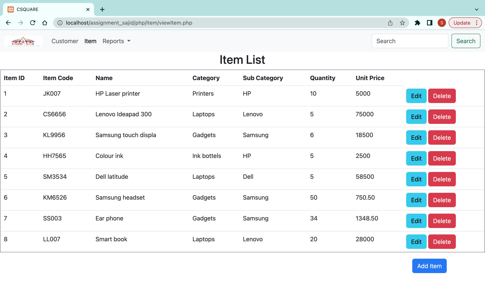
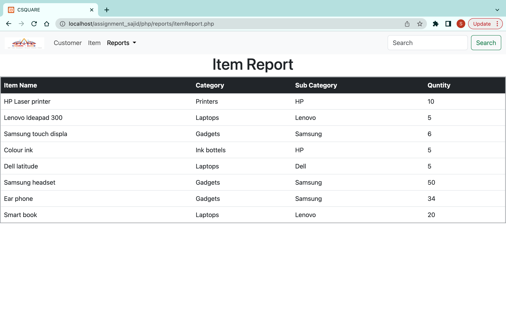

# assignment_csquare
Assumptions
1. customer names and item name cannot have numeric digits.
2. customer contact number should be 10 digits numbers.
3. item code's first two letter should be capital character(A-Z) and others are numbers(0-9)
4. item quantity can only get digits
5. item unit price can only get digits and decimal values
6. customer details and item details can be edited
7. customer and item can be deleted
8. invoice report and invoice item report can be filtered by providing range of dates
9. server name = "localhost:3306"
10. user name = "root"
11. password = "sajid205"
12. database name = "assignment"

How to setup project
1. import the database file to the server
2. start the XAMPP web server
3. put the project folder(assignment_csquare) into htdocs
4. and find the => http://localhost/assignment_csquare/php/customer/viewCustomer.php

Images

